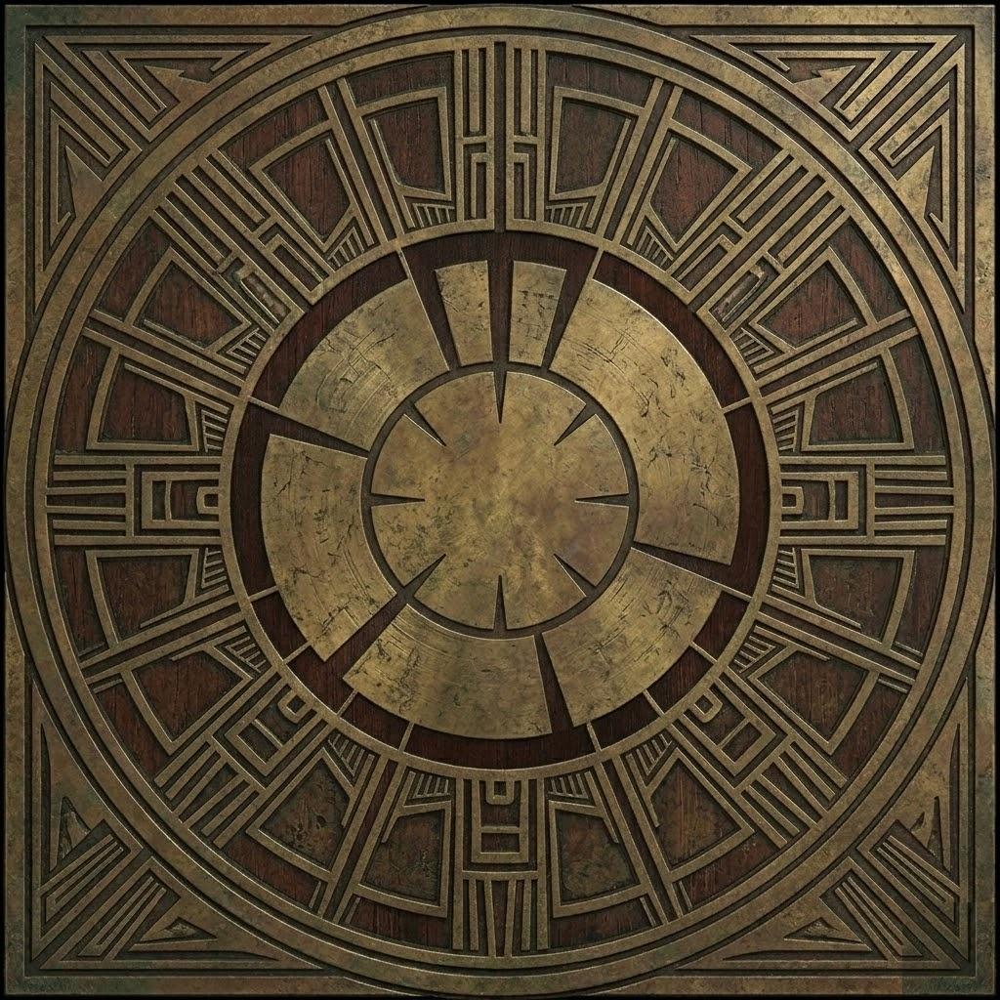

# Lament Configuration Box

An interactive, 3D rendered puzzle box inspired by the Hellraiser universe. This application meticulously renders the legendary LeMarchand's Box using Python and the `vpython` WebGL visualization framework, bundled with chilling ambient music.

 *(Placeholder preview image)*

## Features

- **Interactive 3D Engine:** High-fidelity 3D rendering of the Lament Configuration utilizing WebGL.
- **Dynamic Textures:** Full texture mapping using custom, high-resolution aesthetic assets for the box's unique sides.
- **Ambient Soundtrack:** Integrated looping background music powered by `pygame` for a fully immersive atmospheric experience.
- **Intuitive Controls:** Fluid keyboard-based controls for rotating and inspecting the puzzle box from all angles.
- **Standalone Ready:** Code structure explicitly designed to bypass PyInstaller restrictions for seamless compilation into a standalone executable.
- **Seamless Local Rendering:** Fully embedded Python local HTTP server to automatically bypass local file CORS restrictions during texture rendering.

## Prerequisites

- Python 3.9+
- `vpython`
- `pygame`

## Installation

1. Clone or download the repository to your local machine.
2. Ensure you have the required dependencies installed:
   ```bash
   pip install -r requirements.txt
   ```
   *(Or just install `vpython` and `pygame` manually).*

## Running the Application

To launch the 3D visualizer, run the main configuration script:

```bash
python lament_config.py
```

The application will start a lightweight local web server in the background and automatically open a new tab in your default web browser displaying the 3D scene.

## Controls

The application features a clean, embedded UI overlay specifying the controls. The box relies on direct physical keyboard inputs:

* **Rotate:** Use the `Up`, `Down`, `Left`, and `Right` Arrow keys to spin the cube in 3D space.
* **Zoom In:** Hold the `+` key (or `=` key).
* **Zoom Out:** Hold the `-` key.
* **Music Toggle:** Use the "Background Music" checkbox located within the browser's top bar to pause or resume the ambient audio.

## Technical Details

* **VPython and PyInstaller**: Standard `vpython` projects often crash when bundled into `.exe` executables due to namespace issues and missing Javascript dependencies. This program utilizes a custom mocked namespace (`vpython.gs_version`) and a `os.environ['VPYTHON_LIBRARY_PATH']` injector to prepare the environment for headless freezing.
* **Local HTTP Asset Server**: WebGL canvases explicitly prohibit loading unauthenticated local file paths (`file:///`) for 3D wrapper textures due to origin CORS policies. This application cleanly circumvents this by spinning up a lightweight background HTTP daemon (`http.server.SimpleHTTPRequestHandler`) mapping to Port 8000+ natively upon execution.
* **Event Dispatching**: Following strict VPython handling protocols, all UI manipulation interacts exclusively with native Python listeners securely ignoring problematic DOM event bubbling.

## Building (Executable)

If you'd like to package the project as a standalone executable (Windows), you can use the supplied PyInstaller spec:

```bash
pyinstaller lament_config.spec --clean
```

## Credits

Project developed in Python utilizing [VPython](https://vpython.org) and [Pygame](https://pygame.org).
